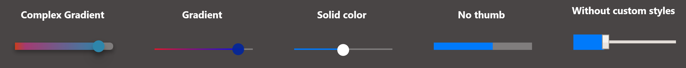

# webkit-input-range-fill-lower

#### WebKit Input Range Fill Lower Hack

Customize the native input range controls like the ```::-ms-fill-lower``` property on WebKit browsers

[](http://badges.mit-license.org)



## New Version 3.x Notice
Because of the increasing interest in this "library", I decided to completely rewrite it.

**WARNING**: the old version isn't compatible with this one. If you want to use the older version you can download it from [here]()


## Key Features
* **Uses native HTML input range type (more accessibility, native behavior)**
* **Doesn't require anymore the external CSS** *new version*
* **Multiple elements** *new version*
* **Customizable styles (solid color or gradient)** *new version*
* **Written in TypeScript** *new version*
* **Pure / vanilla JavaScript (no jQuery)**

View the sample page: https://samuelcarreira.github.io/webkit-input-range-fill-lower (not working...)

## Quick Usage
You only need to follow 4 simple steps to start using this module:

1. Download the script file from the **dist** folder (minified file: `webkit-input-range-fill-lower.min.js`)
2. Add the input range controls on your web page. **Each control needs an unique ID and the max value**
  ```
  // valid
  <input type="range" min="0" max="10" value="10" id="your-custom-id">
  
  // invalid: no ID
  <input type="range" min="0" max="10" value="10">

  // invalid: no max value
  <input type="range" id="your-custom-id">
  ```
3. Call the library after the page is loaded
  ```
  document.addEventListener('DOMContentLoaded', () => {
    const myRanges = new WebkitInputRangeFillLower({selectors: ['your-custom-id', 'your-custom-id2'], angle: 90, gradient: 'rgba(238,174,202,1) 0%, rgba(198,180,216,1) 74%, rgba(148,187,233,1) 100%'});
  });
  ```
4. (Optional) You can customize the input element on the page stylesheet. View the [index.html](index.html) source code to learn more

### WebkitInputRangeFillLower(options)

### Class options
Property         | Type     | Required    | Description
---------------- | -------- | ---------- | ----------------------
`selectors`  | `string[]` | yes     | List of HTML ID attributes. If you want to select multiple selectors use an array like `['your-custom-id', 'your-custom-id2']`, single selector can be defined with a simple string `selectors: 'your-custom-id'`
`angle`  	 | `number` | no   | Gradient angle (0-360 degrees). Default value: 90 (only in gradient color)
`color`  	 | `string` | no | CSS solid color. With can use any CSS color format: hexadecimal, description, rgb or rgba
`gradient`  	 | `string` | no   | CSS gradient color definition. The default value is the gradient `#0ABFBC, #FC354C`. You can set the position of the color on the gradient like `rgba(238,174,202,1) 0%, rgba(198,180,216,1) 74%, rgba(148,187,233,1) 100%`

## Compatibility
As the name indicates, this "library" was written to be compatible with the WebKit engine browsers (Google Chrome, Opera, New Microsoft Edge, etc.).
On Mozilla Firefox you cannot expect the same results even with the `-moz-range-progress` added (read more [here](https://developer.mozilla.org/en-US/docs/Web/CSS/::-moz-range-progress) )


## Motivation and history
I've created this "hack" because I wanted to use a range slider on my Electron App (a music player with volume control). After I tried some plugins like the [rangeslider.js](http://rangeslider.js.org/) I decided to write something more lightweight and more easy to use.
As Electron apps use Chrome (WebKit) as the render engine, ~~I didn't add any compatibility with other browsers/fallbacks to older versions~~ (on the new 3.0 version I've added the Mozilla firefox and Microsoft Internet Explorer 'fallback' property).

## How this 'hack' works
This 'hack' uses the `::-webkit-slider-runnable-track` CSS pseudo-element (which represents the "track" or the groove in which the indicator slides of an input type="range"). Because you cannot access this property directly on an inline CSS style, this library needs to write a custom style tag directly on the page header where it's set the custom styles and the background style.
Because you can "set the size" of the background (when you use a linear gradient), this 'library' calculates the percentage of the value on the input range element and adjusts the size of the background to that percentage. Each time the input range value is changed, the event listener updates the background-size.


## Credits
- Developed by: Samuel Carreira
- Inspired on this article: http://brennaobrien.com/blog/2014/05/style-input-type-range-in-every-browser.html

## License
- **[MIT license](http://opensource.org/licenses/mit-license.php)**
- Copyright 2020 © <a href="http://samuelcarreira.com" target="_blank">Samuel Carreira</a>.


https://developer.mozilla.org/en-US/docs/Web/CSS/::-moz-range-progress